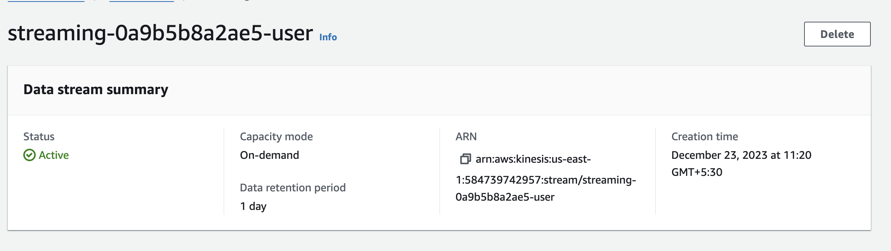

# Pinterest Data Pipeline

## Table of Contents

- [Data](#data)
- [Tools Used](#tools-used)
- [Set Up](#set-up)
  - [Configuring EC2 Kafka Client](#configuring-ec2-kafka-client)
  - [Connecting a MSK cluster to a S3 bucket](#connecting-a-msk-cluster-to-a-s3-bucket)
  - [Configuring an API in API Gateway](#configuring-an-api-in-api-gateway)
  - [Databricks & Spark on Databricks](#databricks--spark-on-databricks)
  - [AWS MWAA](#aws-mwaa)

## Data

There are three different tables that are processed in this project.These tables are:

- `pinterest_data` - contains data about posts being updated to Pinterest
- `geolocation_data` - contains data about the geolocation of each Pinterest post
- `user_data` - contains data about the user that has uploaded each post

Examples of data from each table:

pinterest_data:

`{'index': 7528, 'unique_id': 'fbe53c66-3442-4773-b19e-d3ec6f54dddf', 'title': 'No Title Data Available', 'description': 'No description available Story format', 'poster_name': 'User Info Error', 'follower_count': 'User Info Error', 'tag_list': 'N,o, ,T,a,g,s, ,A,v,a,i,l,a,b,l,e', 'is_image_or_video': 'multi-video(story page format)', 'image_src': 'Image src error.', 'downloaded': 0, 'save_location': 'Local save in /data/mens-fashion', 'category': 'mens-fashion'}`

geolocation_data:

`{'ind': 7528, 'timestamp': datetime.datetime(2020, 8, 28, 3, 52, 47), 'latitude': -89.9787, 'longitude': -173.293, 'country': 'Albania'}`

user_data:

`{'ind': 7528, 'first_name': 'Abigail', 'last_name': 'Ali', 'age': 20, 'date_joined': datetime.datetime(2015, 10, 24, 11, 23, 51)}`

## Tools Used

- Apache Kafka
- AWS MSK
- AWS MSK Connect
- Kafka REST Proxy
- AWS API Gateway
- Databricks
- Apache Spark
- MWAA (Managed Workflow for Apache Airflow)

## Set Up

### Configuring EC2 Kafka Client

Created a key pair file using the key pair associated with my EC2 instance. This file was then used to connect to the EC2 instance using an SSH client

Since the AWS account provided for this project already had access to an IAM authenticated MSK cluster, there was no need to create my own cluster. I still needed to install the appropriate packages to the EC2 client machine in order to connect to this cluster. Kafka and IAM MSK authentication package was installed to the EC2 client machine. Once it was installed, I configured the Kafka client to use AWS IAM authentication to the cluster. Once everything was installed, I then created three Kafka topics, `<user_id>.pin` for Pinterest posts data, `<user_id>.geo` for post geolocation data and `<user_id>.user` for post user data

### Connecting a MSK cluster to a S3 bucket

S3 bucket and an IAM role that allows you to write to the bucket have already been configured.

On the EC2 client machine, Confluent.io Amazon S3 connector was downloaded and then copied to the S3 bucket

Created a custom plugin

and a connector

### Configuring an API in API Gateway

I needed to build an API which will send data to MSK cluster, which in turn will be store in S3 bucket using the connector that I created.

First a resource that allows you to build a PROXY integration for the API was created. Then I created a HTTP `ANY` method for this resource and deployed it. Once the API was set up, I set up the Kafka REST proxy on the EC2 client machine.

To send the data to the S3 bucket, I modified the `user_posting_emulation.py` file.

The data from each table is uploaded to the corresponding folder as a JSON file

### Databricks & Spark on Databricks

To batch process data on databricks, I had to mount the S3 bucket on the platform. To do this, the file [mount_s3_to_db](databricks/mount_s3_to_db.ipynb) is run on the platform.

In this notebook, you import the necessary libraries, obtain the AWS credentials needed to mount the S3 bucket. Once the bucket is mounted, three different dataframes are created, one for each topic.

The dataframes created are then cleaned and used for computations in the file [clean_data](databricks/clean_data.ipynb)

### AWS MWAA

MWAA was used in this project to automate the process of running the batch processing on Databricks. A DAG [0a9b5b8a2ae5_dag](0a9b5b8a2ae5_dag.py) was created to run the notebook daily. This was then uploaded to the MWAA S3 bucket

### AWS Kinesis

The first step to processing the streaming data was to create three different streams on AWS Kinesis.

- Stream for geo data
  
- Stream for pinterest data
  
- Stream for user data
  

Then I created new API resources on API Gateway in order to
interact with the Kinesis stream

The API was then redeployed and the invoke URL was once again used in the [user_posting_emulation_streaming](user_posting_emulation_streaming.py) file to retrieve data from the RDS database and send it to the Kinesis stream via the new API.

- pin kinesis stream
  

- geo kinesis stream
  

- user kinesis stream
  

The notebook [kinesis_streaming_data](databricks/kinesis_streaming_data.ipynb) contains the code to reading the data from the Kinesis streams, cleaning the data and then writing the data into Delta tables on Databricks.

- Pinterest data schema and table
  
  

- Geo data schema and table
  
  

- User data schema and table
  
  
